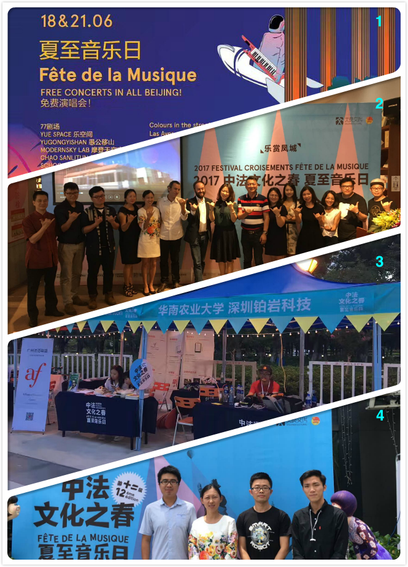
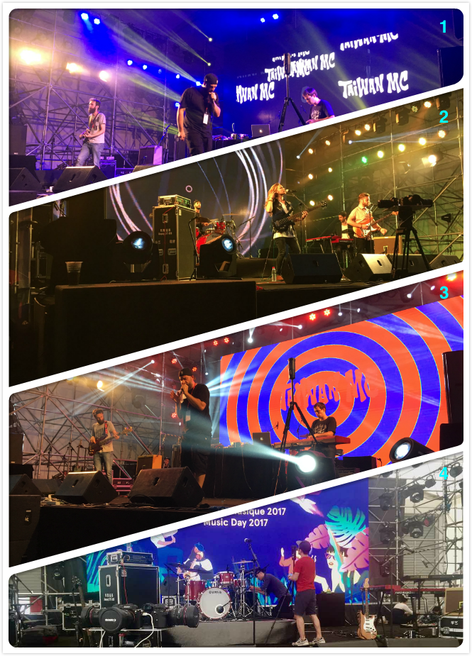
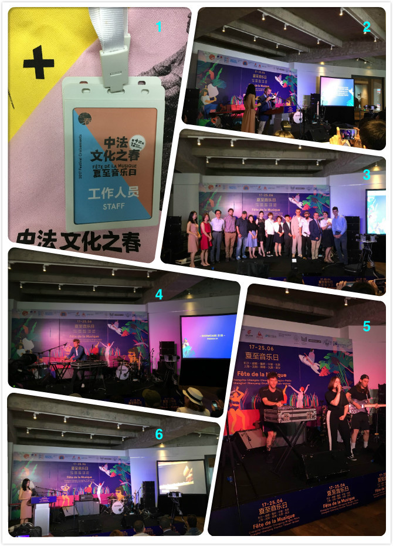
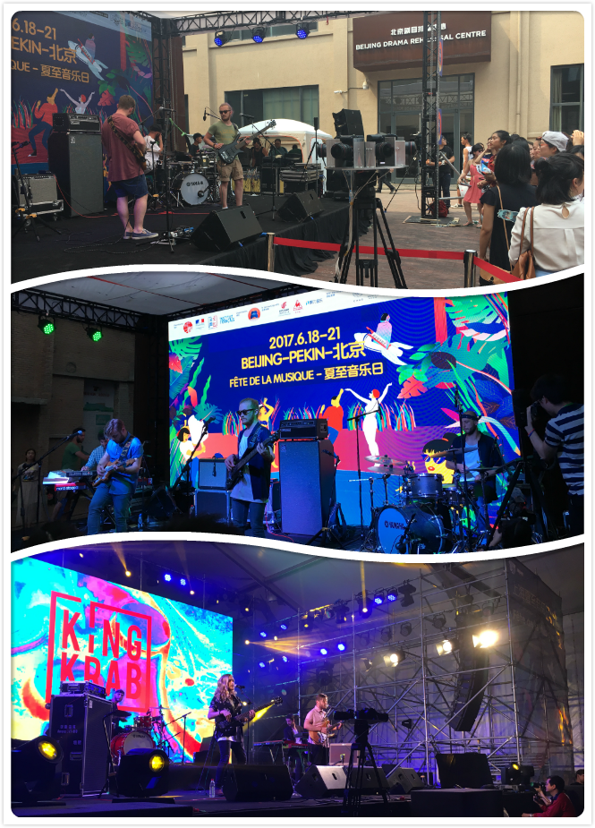
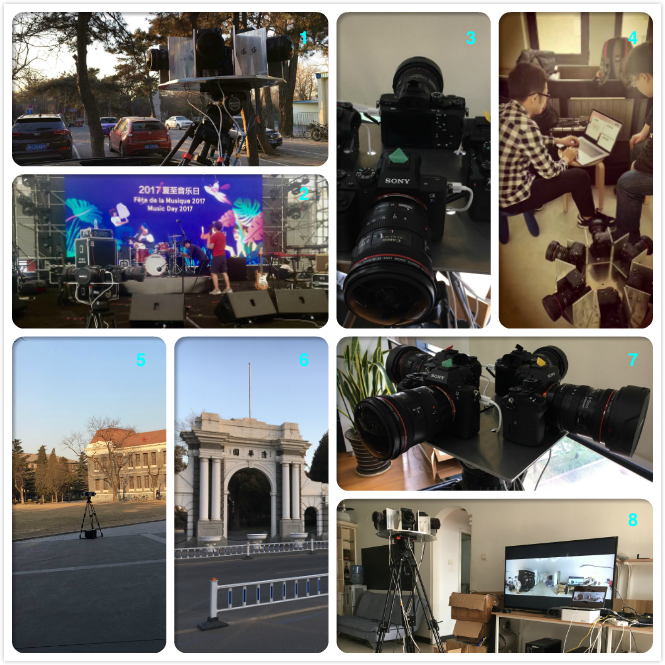
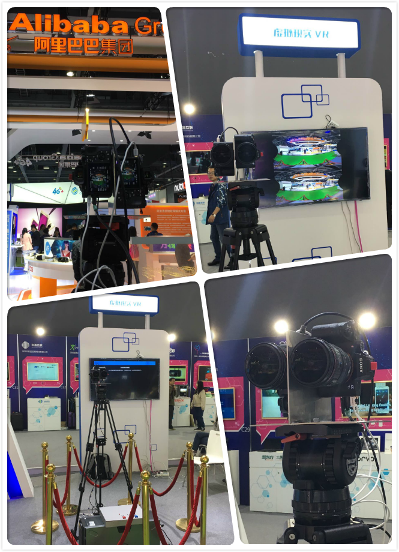
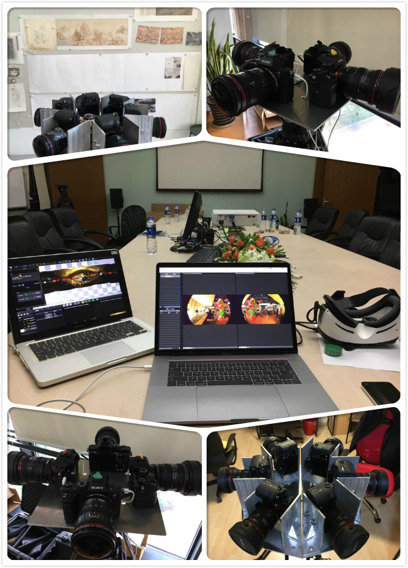
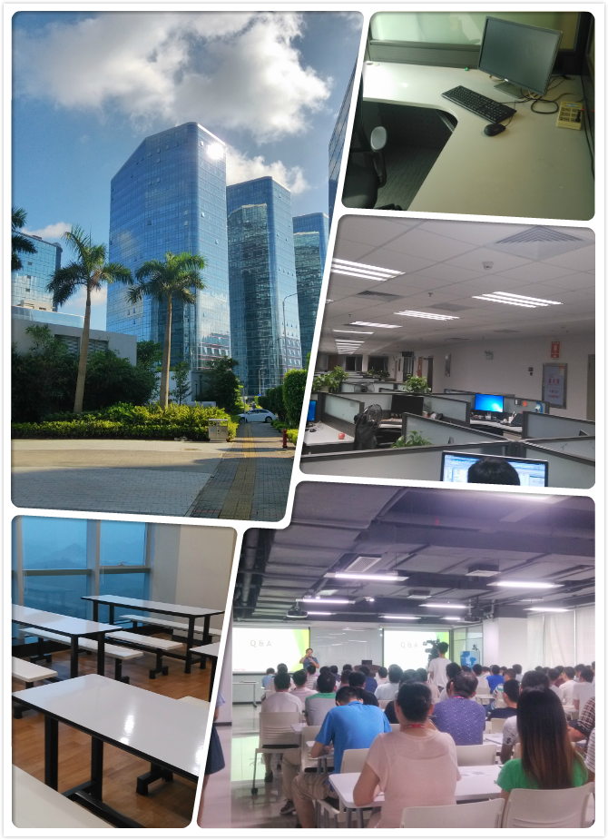

### **Resume Attachment**
#### Base Information
---
- Name：**Cena Hwang**
- Email: hbkekao@gmail.com
- Education: Master Degree Candidate           
- Desired position：**Image Algorithm Engineer**

#### TimeLine
---
- 2017.6 -- 2017.8 南京云岩信息科技有限公司

	> 时间：2017.6.24 地点：顺德德胜广场     
	> 1. “中法夏至音乐节”海报    
	> 2. “中法夏至音乐节”顺德大良发布会现场，导师受邀出席并介绍VR拍摄团队   
	> 3. 音乐节现场VR体验展示摊位   
	> 4. 音乐节开幕活动VR团队合影   
	> 5. 法国大使馆驻广州总领事馆领事及顺德区官员在音乐节现场
	
	</img>
	
	> 时间：2017.6.23 地点：上海西岸艺术中心[**VR Video**](https://www.youtube.com/watch?v=Hfco9ProWhs&feature=youtu.be)   
	> 1、3. TAIWAN MC说唱ZCAM VR拍摄    
	> 2. King Krab乐队四头VR拍摄   
	> 4. 音乐节现场VR相机部署测试
   
	</img>
	
	> 时间：2017.6.20 地点：北京三里屯CHAO酒店   
	> 1. 参与“2017年中法夏至音乐节”拍摄任务，官方工作证件   
	> 2. 法国大使宣布夏至音乐节开幕    
	> 3. 发布会现场与会嘉宾合影，包含法国大使馆官员和媒体、乐队代表   
	> 4. French79现场电音演奏   
	> 5. Las Aves现场摇滚演奏   
	> 6. 主持人介绍官方唯一合作VR团队
	
	</img>

	> 时间：2017.6.18 地点：北京77剧场  
	> VR六头及ZCAM设备交错机位拍摄法国kingkrab乐队现场   
	
	</img>
	
	> 时间：2017.2 -- 2017.6   
	> 1. VR相机架设于车顶进行行进拍摄测试   
	> 2. “2017中法音乐节”上海站部署测试VR相机   
	> 3. VR四头相机设备   
	> 4. 后期拼接工作     
	> 5-6. 清华园门口拍摄VR Demo   
	> 7. VR四头相机设备展示    
	> 8. VR直播延时测试
	
	 </img>
	
	> 时间：2017.2.3  地点：广州市天河区珠江新城      
	> 采用ZCAM设备拍摄的4K VR视频一帧图像，由自主开发的光流拼接算法拼接
	  
	 </img>
	  
	> 时间：2016.12.21 地点：广州市琶洲保利世贸博览馆  
	> 双目摄像头直播展示
	
	 </img>

	
- 2016.12 -- 2017.2 北京和谐立诚科技文化发展有限公司

	> 协助拍摄VR视频，并用Kolor AVP拼接VR视频. [**VR Video**](https://youtu.be/8SOn7JUJ7cU)
	
	
	
- 2016.11 上海网达软件股份有限公司

	> 参与VR直播平台的设计以及搭建
	
	 </img>
	
	
- 2016.5 -- 2016.9 深圳市道通科技有限公司软件开发五部

	> 公司日常
	
	</img>

#### Thanks
---
Thank you for taking the time to read my resume attachment and hope to have the opportunity to work with you.
